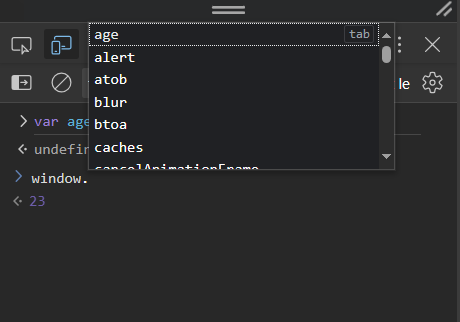

## Lesson 1.4: Variables
> Variable are used to store data.

> var , let or const are used to store data.

> js has two versions ES5(var) & ES6(let, const included)

### var Type variables

> 'var' can be used throughout the program and has function scope.

Example:
```javascript
 function func(){
  var age = 23;
  console.log(age);
 }

age = 20; //can be access outside function
```
>var old js(ES5)main tha.

>var functioned scoped hota hai.

>var apny parent fnc main kahin bhi use ho sakta hai.

>var adds itself to windows object.



### let Type variables

'let' is block-scoped and can be reassigned.

Example:
```javascript
 function func(){
  let age = 23;
  console.log(age);
 }

//age = 20; cannot be access outside function. 

let age = 20; // but we can re assign
```
>'let' and 'const' new js(ES6)main hai.

>'let' braces scoped hota hai.

>'let' doesn't add itself to windows object.

### 'const' Type variables
'const' is used for constants; its value can't be changed.

Example:
```javascript
 const gender = "male";

 // Displaying variables in the console.

console.log("Gender:" + gender);
```