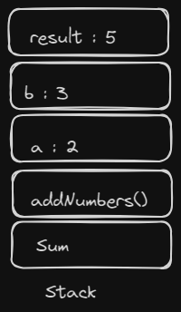
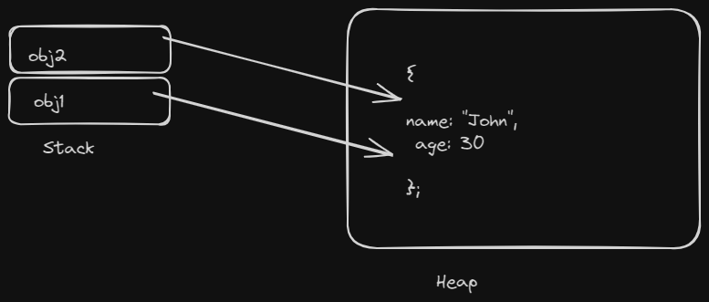

## 2.2 Stack and Heap

**Stack:**

- The stack is a region of memory used for managing function call frames and local variables.
- Data stored in the stack follows a last-in, first-out (LIFO) order, just like a stack of plates.
- Primitive data types like numbers and booleans, as well as references to objects and functions, are stored in the stack.
- Stack memory is usually limited in size.

Example:

```javascript
function addNumbers(a, b) {
  let result = a + b; // 'a' and 'b' are pushed onto the stack
  return result; // 'result' is also on the stack
}

const sum = addNumbers(2, 3); // 'sum' is on the stack
```

**Explain:**

Tamaa'm func aur func code ek order main memory main store hoty hain jisy hum stack kehty hain.Ye LIFO principle py kaam karta hai.
<p align = "center">

<p>

**Heap:**

- The heap is a region of memory used for storing complex and dynamic data structures like objects and arrays.
- Unlike the stack, the heap is not bound by a strict order, and data can be allocated and deallocated at any time.
- Objects, arrays, and other non-primitive data types are stored in the heap.

Example:

```javascript
let obj1 = { name: "John", age: 30 }; // 'obj1' is a reference to an object in the heap
let obj2 = obj1; // 'obj2' now references the same object in the heap
obj2.age = 31; // Modifying object's property
```

**Explain:**

Jitny bhi variables hum bante hain un ko kahi store to karna hota hai un ko hum heap memory mai store karty hain .
<p align = "center">

<p>


