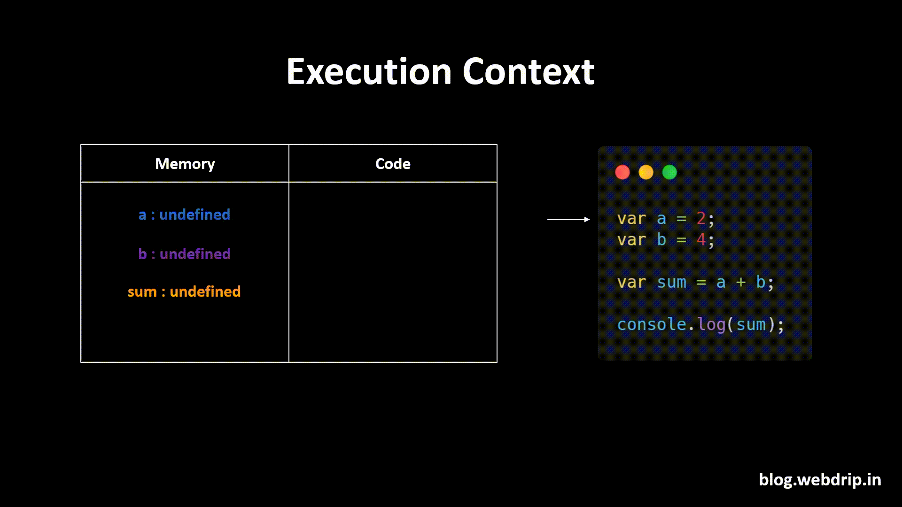

## 2.3 Execution Context:

**Explain:**

Execution Context ka matlab jab bhi hum func chalain gye func apna khud ka imaginary container bana ly ga jisme uski 3 cheezain hoon gi.

1. Variables

2. Func inside that parent func

3. lexicale envirnoment of that func.
   ye jo imaginary container hai issy hi hum execution context kehty hain.

